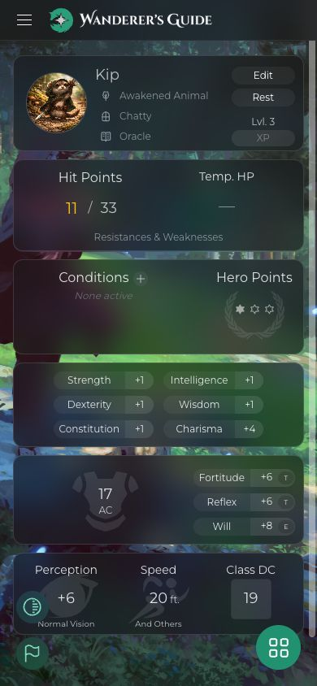
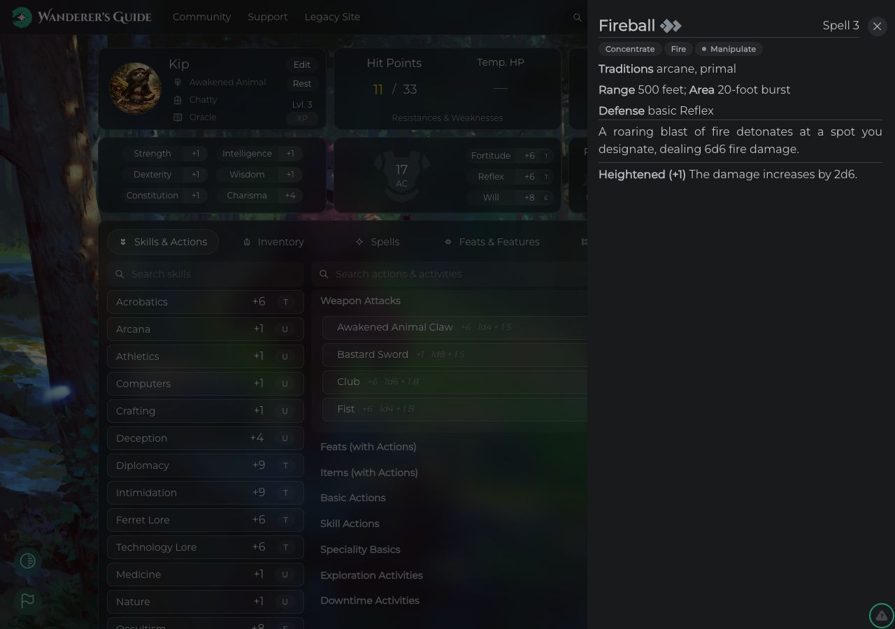

# Branch decisions — September 4, 2026

The useful parts are consolidated into a small, tested integration. Do not merge the old branch tips wholesale. Several fixes already exist in current main; other experiments add risk without enough benefit.

## Keep, drop, and retire

| Branch | Decision | Reason |
| --- | --- | --- |
| `perf/mobile-first-load` (`cfc076e4`) | Salvage optional-font loading and removal of catalog-wide background-art preloads. Retire the remaining diff. | These remove unnecessary downloads with little code. Current main already has newer icon, cache, and initialization fixes. Incoming icon state handling crashes; bypassing production Zod validation also skips normalization. |
| `perf/lazy-modals-and-images` (`db65fcfa`) | Drop the additional changes. It includes the preceding branch. | Manual vendor chunks crash production. Image endpoint rewrites break documented self-hosted storage. Fourteen lazy modal registrations reduced entry JavaScript from 1,163.98 KB gzip to 1,158.18 KB gzip: only 5.80 KB, about 0.50%, while adding loading boundaries and chunks. That result does not justify this implementation. Image runtime caching and other service-worker changes are deferred with it. |
| `feat/content-audit-pipeline` (`54d42dd7`) | Salvage a smaller read-only auditor sharing the existing validator's schema registry. | Structural audits are useful for ongoing content maintenance. The original tool silently treated read failures as completion and included unnecessary write modes. The replacement requires an explicit origin/key, performs GET only, handles capped pages, and marks partial scans incomplete. |
| `fix/content-schema-gaps` (`197c790b`) | Keep current main's already-merged nullable metadata schemas; drop the automatic fixer. It includes the audit branch. | The schema fixes are already present through a separate branch. The fixer guesses class HP, replaces entire JSON columns without concurrency protection, and can count failed readback as success. |
| `feat/content-zod-validator` (`5e0399cb`) | Fold its useful workflow into the existing `.agents/skills/wg-content/SKILL.md`. | This branch contains instructions, not a new validator implementation. Reuse the existing CLI; preserve pending curator submissions, verify intended mechanics, compare before/after, protect concurrent edits, and validate readback. No extra Claude command or overlapping skill is needed. |
| Local `fix/e2e-seed-pg-trgm` | Retire as superseded. | Git's patch comparison confirms the unique commit is already applied in main. |

The selected changes are committed on `codex/curated-branch-integration` and integrated into local `main`. Nothing was pushed or deployed. No old source branch was deleted. The original branch tips and the earlier integration experiment remain available for historical reference. There were no open GitHub PRs at inventory time. Other local feature branches were already ancestors of main; `gh-pages` is deployment output.

## Implemented scope

- The `.claude` to `.agents` consolidation, repaired skills, and moved worktrees are preserved in their own commit.
- Optional OpenDyslexic CSS is requested only when the active theme uses it. The effect watches the actual theme boolean, rather than the old branch's character-only dependency. Existing theme settings and image URLs are preserved.
- Background artwork loads when displayed; ancestry/class preloads are unchanged.
- `audit:content` scans raw rows with the app's current schemas and writes a private local report. It has no write flags, hard-coded production project, or credential-discovery path. It uses increasing IDs, a per-table starting maximum ID, and continues after short server-capped pages. Failed reads produce an incomplete report and exit 2.
- `validate:content` and `audit:content` share one CLI registry. The file validator also rejects prototype-property names as invalid types.
- Development docs cover credentials, scope, privacy, live-scan limitations, commands, and exit codes. Content-repair guidance is consolidated into the existing project skill.

The audit is structural, not a game-rules validator or a transactional database snapshot. No live database repair or content approval was performed, and the new auditor was exercised against local fixtures rather than a production-wide content sweep.

## Verification

- Final `npm --prefix frontend run build`: passed (TypeScript, Vite, PWA packaging).
- Separate TypeScript check for all three CLI source files: passed.
- Audit CLI regression suite: 7 passed. Covers server-capped pages, a later HTTP 503, invalid rows, repeated pages, malformed responses, write flags, invalid table names, and private report permissions when overwriting an existing file.
- Existing file validator: valid trait input exits 0; invalid type `constructor` exits 2 with usage guidance.
- `npm run docs:check`: no broken links. The pre-existing Mintlify OpenAPI-version/config warning remains.
- Production UI at a fresh local origin: public sheet renders at 390 px with document width 390 px; portrait and background render, Montserrat is applied, and no OpenDyslexic stylesheet is present when disabled. Condition selector opens and is dismissed without changes. Desktop Fireball drawer renders action symbols, traits, stats, and description. The entry asset matches the final build (`index-ytkIWMZ2.js`).
- Independent Standards and Spec reviews found no blockers. A reviewer found that existing report-file permissions could remain broad; this was fixed and the regression suite checks it.

Generic browser error events occur in both the curated build and unchanged main. Their individual resource causes were not traced; they did not prevent the inspected sheet or drawer from rendering. The earlier manual-chunk initialization crash is absent. Remaining build warnings include large existing chunks and stale Browserslist data. Authenticated edits, enabled-font account settings, all UI screens, and service-worker upgrades across deployments were not exhaustively exercised.

The earlier [merge audit](merge-audit.md) documents the rejected full-branch combination and its failures. This document describes the retained implementation; the earlier audit is historical evidence, not the status of this curated result.

## Screenshots

Mobile production sheet:

Desktop production spell drawer:

