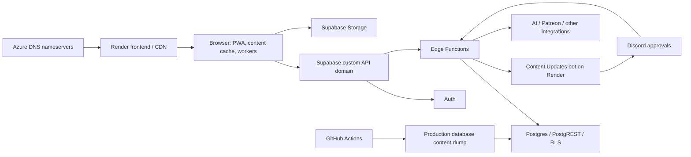

# Infrastructure and operations audit: initial findings and scope

Reviewed September 4, 2026 against local/GitHub main `d782bd79`. This is the
surface inventory and initial evidence for selecting deeper audits. Production
configuration was not changed. No load tests, paid AI calls, writes, restores,
deployments, or Discord messages were performed during this investigation.

## Incident evidence

The confirmed WG outage announcement located in Discord is from **July 18, 2026,
19:06 UTC (15:06 EDT)**. It attributes a brief outage to a deployment-pipeline
caching change leaving backend services stale:
[announcement](https://discord.com/channels/735260060682289254/750870359552688189/1528115777331396728).
This is the stated cause in the announcement, not an independently reconstructed
incident timeline. The user has not yet identified the date of the outage they mean.

The September 1 DDoS discussion concerns attacks against Pathbuilder and asks about
WG preparedness; it does not establish a WG attack:
[discussion](https://discord.com/channels/735260060682289254/1220837734277714080/1544237527722889328).
An August 5 Ooze Eidolon report concerns a specific content drawer failing to load,
which is a separate symptom from a site-wide service outage.

Evidence reviewed: the earlier August 21–September 4 guild-search archive, additional
Discord searches since July 1, current public DNS/HTTP responses, GitHub deployment
metadata, Supabase CLI project/function metadata, and repository code/configuration.
Search indexing, permissions, and attachments limit Discord coverage. Historical
Render/Supabase incident logs and metrics have not yet been examined.

## Observed production topology



- `wanderersguide.app` resolves to `216.24.57.1`, the documented
  [Render load-balancer address](https://render.com/docs/configure-other-dns).
  This establishes the hosting route; the service's dashboard plan/build settings
  still need inspection. Its nameservers are Azure DNS. A Cloudflare response header
  does not establish that WG has a separately configured Cloudflare WAF account.
- The public site returned HTTP 200 and served `assets/index-DyUWCFKS.js`. The bundle
  includes the new `eidolon_weapon_id` and `Share runes` markers.
- `api.wanderersguide.app` aliases `fdrjqcyjklatdrmjdnys.supabase.co`. The matching
  `wanderers-guide` project is `ACTIVE_HEALTHY` in `us-east-1`.
- Auth health returned 200. A correct, bounded `get-content-versions` request for
  source 1 returned HTTP 200, JSend success, one row, in approximately 0.32 seconds.
  An earlier probe used the wrong parameter and returned a validation failure; it
  was corrected. API-root HTTP 404 is not evidence of an outage.
- Supabase lists **59 active functions**; this checkout contains **55** function
  entry points, including the self-host router. The latest listed deployment time
  is August 24 at 23:06 UTC. Deployment times alone do not prove which source revision
  each function contains.
- Docs are served through Mintlify. GitHub Pages points to `gh-pages` without a
  custom domain; it is not the observed production root-domain route.
- Docker Compose is explicitly a community self-host/local test stack. Its missing
  production hardening must not be misreported as the hosted production topology.

## Confirmed operations findings

The saved [probe](operations-worker-probe.mjs) bundles the actual
`operations.main.ts` and replaces the worker transport and variable-store boundary
with controlled fixtures. Run from any working directory after installing frontend
dependencies:

```bash
node .agents/reports/2026-09-04/operations-worker-probe.mjs
```

Observed output:

```json
{"probe":"out-of-order completions","storeImportOrder":["newer","older"],"staleStoreCommitted":true}
{"probe":"worker runtime failure","hasErrorHandler":false,"hasMessageErrorHandler":false,"promiseState":"pending"}
```

1. **Older results can replace the newer store.**
   `frontend/src/process/operations/operations.main.ts:177` imports the returned
   character store before the caller can reject an outdated result.
   `frontend/src/utils/use-character.tsx:271` checks freshness later, after that
   import has occurred. The same unconditional import exists for creatures at line
   196. Audit acceptance criterion: latest execution wins before any store or
   character side effect commits, including rapid character switching.
2. **Worker load/runtime failures have no completion path.**
   `operations.main.ts:123` registers `onmessage`, but no `onerror` or
   `onmessageerror`, deadline, or worker replacement. Dispatch stores a pending
   resolver at line 157. The isolated failure probe remains pending; an exception
   caught inside the worker's normal request handler is a different, handled path.
   `use-character.tsx:265` also lacks rejection/finally cleanup for a rejected
   execution. Audit acceptance criterion: a failed calculation leaves a recoverable
   UI, clears loading, preserves the last valid state, and can run again.

These probes demonstrate scheduler/error-handling defects, not their frequency on
real characters or their involvement in the historical outage. Full character and
browser regressions are part of the proposed deep audit.

## Ranked audit surfaces

| Priority | Surface | Existing evidence or concern | What the deep audit must establish |
| --- | --- | --- | --- |
| 1 | Deployment consistency and rollback | July 18 announcement; frontend, functions, schema and content have separate release paths. Four deployed functions have no local implementation: `find-campaigns`, `find-characters`, `find-encounters`, `get-sheet-content`. The self-host-only `main` router is also deployed to cloud. | Inventory every Render service/build command and deployed function body; associate releases with a commit; explicit gateway settings; shared-module invalidation; safe migration ordering; health gates and rollback. Determine consumers before retiring remote endpoints. |
| 1 | Operation execution lifecycle | Two reproduced findings above. Round-robin dispatch does not track worker occupancy; asynchronous worker handlers share module-level stores, selections and deferred operations. | Out-of-order completion, overlapping runs within one worker, cancellation, worker crashes, rapid edits, character switching and companion isolation. Verify failure recovery before any save occurs. |
| 1 | Database capacity and scheduled work | `.github/workflows/db_dump.yml:4` dumps production on every main push as well as weekly. Its comments identify historical I/O saturation. Several content handlers fetch an entire corpus through `fetchData`. | Incident-time CPU/I/O, memory, connections, locks, timeouts and query latency; dump/release correlation; expensive query plans; bounded pagination/payloads; indexes and RLS query cost. No causal conclusion from comments alone. |
| 1 | API admission, abuse and cost controls | Rate-limit state is per-process and keyed by raw token. The common public anon JWT receives the 240/minute JWT bucket. JSON parsing precedes limiting. No global bucket eviction is visible. `open-ai-request` forwards to a paid upstream without an explicit user/role check in its handler. | Authenticated identity and anonymous limits, distributed/cold-worker behavior, key churn, request size, account/role checks, endpoint cost caps, upstream deadlines and provider edge controls. Do not use expensive live calls as probes. |
| 2 | Operations rules and content safety | Multi-pass creation/grants/conditionals/deferred binding; recursive granted ability blocks; expression evaluation; proficiency reconciliation; derived inventory changes. | Determinism and idempotence; phase dependencies; cycle/depth/work limits; malformed content isolation; give/remove symmetry; level up/down; modes; typed bonus stacking; selections; variant combinations. Shape validation alone cannot prove rules correctness. |
| 2 | Save integrity and authentication lifecycle | Optimistic saves, conflict merging, retry behavior and auth refresh interact with asynchronous calculations. Some prior save-loss and session bugs already have fixes. | Offline/reconnect and two-tab edits; expired sessions mid-save; late responses after navigation; rejected writes versus conflicts; duplicate mutations after gateway failures; atomic update checks; no saving incomplete calculations. |
| 2 | Cache and release coherence | CDN, service worker, IndexedDB corpus, source version tokens and React Query all cache different state. A 24-hour corpus TTL exists alongside source-version checks. | Old tab/new deploy, missing old chunks, worker cache failures, stale source tokens, private/public scope changes, failed hydration and partial fetches, cross-account logout/login, clear recovery messages. |
| 2 | Backups and recovery | Repository dumps deliberately exclude user tables. Self-host docs explicitly omit backups. Production backup/PITR settings and restore evidence are not yet verified. | Actual production backup policy, retention, RPO/RTO, restore drill, roles/auth and uploaded objects, independent recovery access, rollback and incident runbooks. A sanitized content dump is not a user-data recovery plan. |
| 2 | Authorization and deployed configuration | RLS plus handler auth, service-role code paths, API keys acting on behalf of owners, and 38 explicitly configured function gateway entries. Remote-only legacy endpoints remain active. | Full owner/member/viewer/anonymous access matrix, live RLS/migration parity, exposed columns, campaign joins, API grants, admin functions, service-role escalation, per-function gateway intent and obsolete routes. |
| 2 | Observability and incident response | Structured logs exist for selected anomalies. Unexpected handler failures can return HTTP 400 or HTTP 200 with JSend failure. Browser failures mostly log locally. | Synthetic site/auth/content/save/calculation checks; semantic success metrics, request/deploy/execution IDs, provider logs, alert owners, retention, dashboards and an incident timeline. Inspect existing provider settings before assuming none exist. |
| 3 | Content approval and external integrations | Render bot callback, Discord message state and database apply steps cross service boundaries. Approval idempotency was previously improved; creation still depends on a remote bot call after insert. | Bot cold starts and failure recovery, duplicate events, signed/shared-secret callbacks, backlog reconciliation, retry safety, partial transactions; Patreon, dice, OAuth/SMTP, AI/vector services and provider outages. |
| 3 | Storage, files, DNS and edge delivery | Azure DNS, Render frontend route, Supabase custom API, separate docs host; public file uploads and storage buckets. | DNS ownership/expiry, TLS, platform DDoS limits, cache headers, bucket policies, quotas, upload validation, missing-object cleanup, storage backups and origin exposure. Render's platform protection does not by itself establish API-layer protection. |
| 3 | Dependencies and operational access | Multiple Node/Deno/container/runtime dependency graphs and dashboard-managed services. | Reachable dependency advisories, reproducible builds, runtime support, action pinning, admin access/2FA, secret ownership and rotation, deployment credentials and a documented service inventory. |

## Credential exposure check

Source code references `VITE_CLAUDE_KEY`, `VITE_DEEPSEEK_KEY`, and
`VITE_FIRECRAWL_KEY`; one client enables browser-side Anthropic use. These are audit
targets. The current public entry bundle did **not** contain the local configured
values for those keys or `OPENAI_KEY`, and no Anthropic-key pattern was found. No
credential value was printed or sent to another service. This narrow check does not
cover every historical build or optional asset, so it is not an exposure clearance.

## Recommended first pass to approve

Start with deployment consistency, operation execution lifecycle, and API/database
capacity. Those cover the confirmed historical incident class, two reproduced code
defects, and the services capable of affecting every user. Include monitoring and
backup verification alongside them so the next incident is diagnosable and recoverable.

Still needed for the historical investigation: the intended outage date/symptom,
the corresponding Render deploy/service logs, and Supabase request/error/resource
metrics for that window. Supabase CLI metadata access works. Render dashboard
settings, historical logs, WAF configuration, backup configuration and restore
procedures have not yet been validated.

Provider references: [Render DNS](https://render.com/docs/configure-other-dns),
[Render hosting and platform DDoS protection](https://render.com/docs/static-sites),
[Supabase current project-log API](https://supabase.com/docs/reference/api/v1-get-project-logs).
