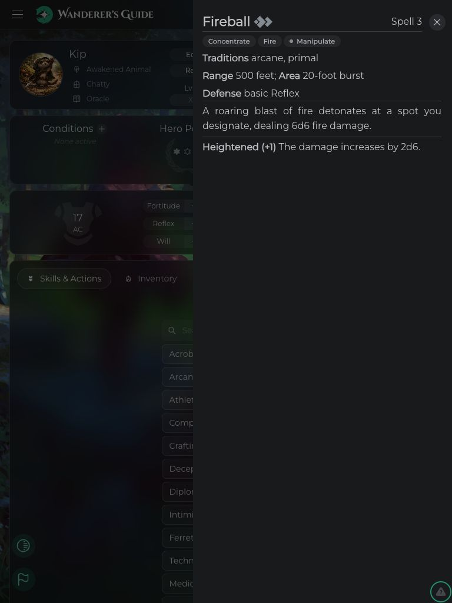
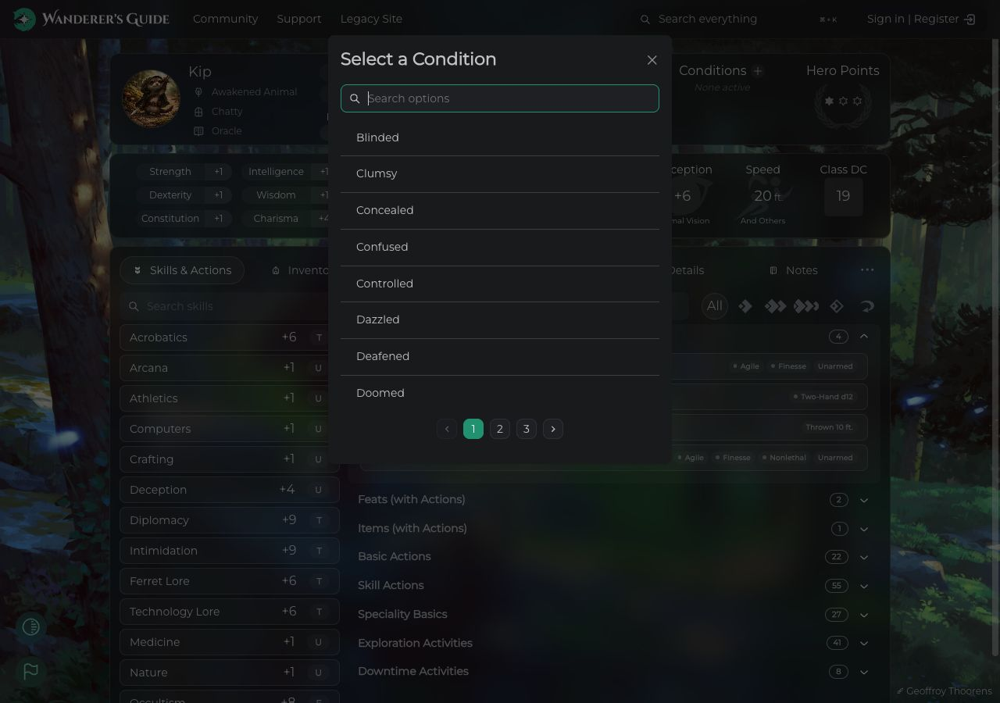
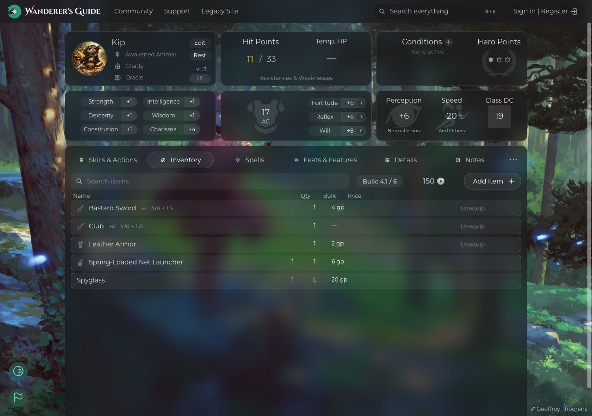
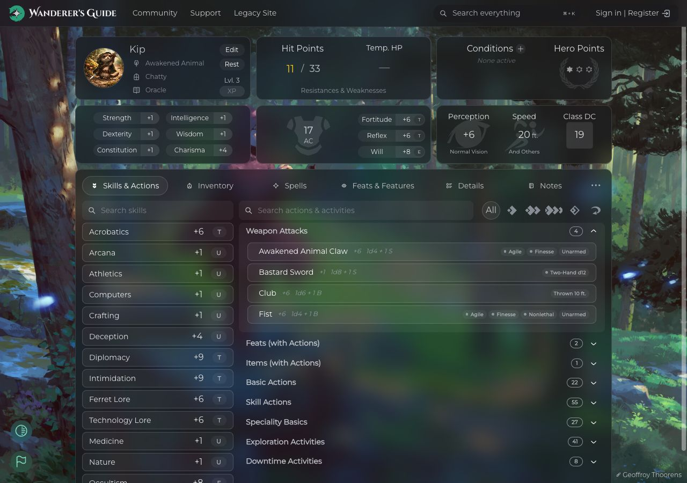

# Wanderer’s Guide merge audit — September 4, 2026

**Recommendation: do not merge all remaining branches as they stand.** The combined production build compiles successfully but crashes before rendering. There are also independently reproduced icon and content-audit defects and unsafe repair behavior.

## Scope and branch inventory

Fetched/pruned `origin`, then pinned the base to `3a25959f` (current `origin/main`). The working checkout remains on local `main` at `d834a97e`; that one-commit difference is a schema/data refresh. GitHub returned **zero open pull requests**. Reviewed every remaining remote source branch with commits outside the pinned base, plus local-only exceptions.

| Unmerged branch | Head | Relationship and recommendation |
| --- | --- | --- |
| `perf/mobile-first-load` | `cfc076e4` | Ancestor of the next branch; do not merge separately. |
| `perf/lazy-modals-and-images` | `db65fcfa` | Hold: production startup, icon implementation, image compatibility, conflicts. |
| `feat/content-audit-pipeline` | `54d42dd7` | Ancestor of `fix/content-schema-gaps`; hold until failed-read handling is fixed. |
| `fix/content-schema-gaps` | `197c790b` | Hold write tooling: concurrency and verification safeguards missing. Numeric-nullability changes have no additional verified consumer regression. |
| `feat/content-zod-validator` | `5e0399cb` | Command-only instructions; migrate `.claude/commands/fix-content-issues.md` into an `.agents` skill before integrating. No UI changes. |

`fix/e2e-seed-pg-trgm` has a commit not reachable by ancestry, but `git cherry origin/main fix/e2e-seed-pg-trgm` reports its patch already present. Other local feature branches are ancestors of `origin/main`. `origin/gh-pages` is deployment output, excluded from source integration.

There was no independent issue/spec available for these remaining branches. Commit descriptions and branch READMEs were used as stated intent. Full SHAs, commands, and commit messages are in [scope.md](scope.md).

## Integration result

The isolated checkout is `/tmp/wg-audit-20260904/integration`, with audit-only merge commit `f57cde06`. No source branch or remote was merged or pushed.

The three independent tips produced conflicts in **12 files**: 10 in the performance merge (`Icon.tsx`, `ItemIcon.tsx`, `DiceRoller.tsx`, `main.tsx`, `InitiativeRollModal.tsx`, `SelectIconModal.tsx`, `CampaignOverviewPage.tsx`, `EncountersPanel.tsx`, `CharacterSheetPage.tsx`, `vite.config.ts`), plus `frontend/package.json` and `frontend/.gitignore` in the content-tool merge.

For the audit combination, retained current main’s newer game-icon implementation, inline item/dice icons, and picker behavior; combined the one-time cache cleanup with preconnect; retained Safari 15 targeting and current QueryClient/Supabase setup; combined all npm scripts and ignore rules. This matters: accepting every incoming side would regress newer main behavior and introduce the separately reproduced icon crash.

### I1 — P1: compiled app crashes at startup

The incoming `manualChunks` rules in `frontend/vite.config.ts` divide React and its dependent vendors into chunks that fail during initialization in this combined build. The production browser displays a blank page and reports:

```text
TypeError: Cannot set properties of undefined (setting 'Activity')
  at Gy (assets/react-C_P2LsMG.js)
  at qo (assets/react-C_P2LsMG.js)
  at qg (assets/charts-D3vxW3mO.js)
  at Ug (assets/charts-D3vxW3mO.js)
  at assets/editor-BmIjJyUS.js
```

Controlled checks: unchanged `origin/main` builds and renders the public sheet/Fireball drawer. The same combined source, with only manual vendor splitting removed for the JavaScript control, also renders. This isolates the failure to the chunk configuration. Exact module-cycle remediation still needs implementation and verification; a passing TypeScript/Vite build is insufficient.

The control’s PWA packaging fails because the default 2 MiB precache ceiling rejects its larger output chunks. Its emitted JavaScript was used only for the startup experiment. Removing `manualChunks` alone is therefore **not a complete proposed fix**; adjust chunk boundaries and precache policy together and retest the complete production build.

Evidence: [combined build log](combined-build.log), [main build log](baseline-build.log), [control log](control-build.log), screenshots below.

### I2 — P2: the repair tool guesses class mechanics

`fix-content.ts:70–89` repairs any class’s missing HP-per-level value by assigning `8`, described as a median. That is not evidence of the intended class mechanic. It conflicts with the command’s instruction to defer balance/semantic judgment to authors. Require an explicit author-verified value for each affected class rather than a global automatic default. No production repair was run during this audit.

## Standards

This axis reports documented conventions and contracts separately from behavior intent. Ancestor findings are counted once.

1. **P1 — Self-hosted backgrounds break.** `db65fcfa`, `frontend/src/utils/images.ts:46–49` rewrites all storage object URLs to the image-transform endpoint. `docs/docker.md:76` explicitly documents that self-hosted storage serves originals without image transformations. Both background callers lack an HTTP-error fallback. Preserve originals when transforms are unavailable.
2. **P1 — Failed audits can report success.** `54d42dd7` / `197c790b`, `audit-content.ts:157–159` returns normally after an HTTP read failure. This contradicts the README’s complete-table audit and CI-gate contract. Propagate failures and mark incomplete audits as failed.
3. **P2 — Repair workflow safeguards are missing.** The command at `5e0399cb`, `.claude/commands/fix-content-issues.md:69,79–81`, requires readback validation and pending-curator-update checks. Neither script queries the pending queue; the bulk auditor counts PATCH success without rereading, and the row fixer counts failed readback validation as fixed.
4. **P2 — Required development docs missing.** New `audit:content` and `fix:content` scripts/environment setup have no corresponding `docs/development.mdx` update, required by the workspace skill’s “Keeping docs in sync” rule.
5. **P3 — Export documentation missing in incoming code.** `Icon.tsx:142` adds `loadGameIcons()` without the JSDoc required by `wg-ui`. The audit combination keeps main’s documented implementation.
6. **Judgment: possible duplicated code.** `fix-content.ts:46–60,120–138` duplicates the auditor’s content registry and access setup. Share those pieces to avoid drift when content types or access behavior change.

**Standards: 6 findings (5 documented, 1 judgment); highest severity P1 for background compatibility and incomplete audits.**

## Spec

No independent specification was supplied; quoted requirements below come from branch commit descriptions/READMEs.

1. **P1 — Game icons crash when loaded.** `db65fcfa` / `cfc076e4`, `frontend/src/common/Icon.tsx:302,307`, passes a component function directly to `setGameIcon`. React invokes it as a state updater and stores its returned element; `<IconComponent>` then throws an invalid-element error. This contradicts “render saved game icons on demand.” The reproduction fails with that code and renders SVG when changed to `setGameIcon(() => gameIcons[name] ?? null)`. The combined checkout avoids it by preserving current main.
2. **P1 — Failed reads produce a clean audit.** The exact branch pagination generator, run against a mocked HTTP 503, completes normally with zero rows; main then reports `OK 0/0` and can exit zero. This violates “reads every row” and the CI-gate intent. [Reproduction and output](reproductions/audit-read-failure.output.txt).
3. **P1 — Repairs can overwrite concurrent edits.** `197c790b`, `fix-content.ts:228–236` sends entire cloned `meta_data` or `operations` columns through an ID-only PATCH (`:156`). An intervening edit to an unrelated field in that JSON is lost even if validation passes. This violates the claimed guarantee that a fix cannot leave a row worse. Use an atomic leaf update or compare against the original value before updating.
4. **P2 — Failed verification is counted as a repair.** `fix-content.ts:238–241` prints `STILL INVALID` for missing/invalid readback, increments `fixed`, and exits successfully. This fails the stated requirement to confirm the write landed and is valid. Treat failed confirmation as failure.
5. **P2 — Pending content submissions are not checked by the write scripts.** The merged command explicitly requires checking `content_update` first. Preserve that prerequisite in the integrated workflow and enforce it in the tools where appropriate.

**Spec: 5 findings; highest severity P1 for icon rendering, audit completeness, and concurrent-edit preservation.** No production credentials were used in these reproductions. [Icon reproduction output](reproductions/icon-updater.output.txt).

## UI audit and validation

| Check | Result |
| --- | --- |
| Unchanged main production build | Pass; sheet and Fireball drawer render. |
| Combined TypeScript + production build | Pass, with bundle-size/static-import warnings. |
| Combined production runtime | **Fail: blank page on startup**, described in I1. |
| Combined dev home | Rendered at desktop and 390 px mobile widths. |
| Combined dev public sheet `/sheet/142809` | Rendered at mobile, tablet, desktop; 390 px viewport had 390 px document width and no horizontal overflow. |
| Fireball content drawer | Rendered at tablet width; title, action symbols, traits and description present. |
| Select a Condition modal | Opens and renders options; closed without selecting or saving. |
| Desktop Inventory tab | Activates and renders equipment rows using preserved main item icons. |
| Migration documentation | `npm run docs:check` reports no broken links, but emits an OpenAPI version/config warning; that warning remains unresolved. |
| Migration preservation | 119 original skill files byte-identical; 3 intended documentation edits; no missing original skill files and no broken skill links. |

### Visual follow-up priorities

**Phase 1 — Critical:** resolve production startup and self-hosted background failure before visual approval. Preserve main’s working icons during conflict resolution.

**Phase 2 — Refinement:** existing nested-button/nested-paragraph React warnings and a leaked `noBorder` DOM prop appear in the development UI. These stem from existing main components (`LoginButton`, `ImprintButton` and sheet content), not the new chunk changes. Address semantic markup/focus behavior in a separate focused change. Mobile and tablet layouts inspected here did not show a new clipping defect.

**Phase 3 — Polish/performance:** production build warns that `SelectIconModal` and `SelectContent` are also statically imported elsewhere, so their lazy registrations do not defer those modules. Measure the actual initial request graph after fixing chunking; do not rely on the branch’s first-paint size claims. Current main’s idle icon preload also remains in this conflict resolution and should be an explicit performance decision.

Limits: dark-mode, anonymous/public-sheet flows only. Authenticated builder edits, campaigns, account/API-client modals, portrait uploads, light mode, keyboard-only coverage, real database writes, and service-worker upgrades across deployments were not fully exercised. This is not blanket certification of every screen. Production runtime failure prevents a merge sign-off regardless of the successful development previews.

## Configuration migration completed

The root `.claude` folder is gone. `.agents/skills` now contains 21 skills: eight existing project skills consolidated with the user’s Codex edits, and thirteen broken links restored from installed personal skill content. The workspace skill is now `wg-workspace`; Claude-only preview calls and the incorrect `.Codex/launch.json` pointer were replaced with terminal/browser instructions.

All three worktrees moved through `git worktree move` to `.agents/worktrees`, retaining their heads and prior clean/untracked state. The old configuration and permissions were archived locally under ignored `.agents/legacy`; generated Python caches are ignored. Added root `AGENTS.md`, a migration README, development documentation, and Discord instructions/helper. Existing `.codex/config.toml` and `.mcp.json` were preserved.

The command-only unmerged branch remains historical source: its new `.claude/commands` file has not been silently integrated into the main working tree. Convert it to an `.agents` skill when choosing to integrate that branch.

## Discord access verified

The existing **Content Updates** bot authenticates to **Wanderer’s Guide** (`735260060682289254`). Channel listing, active-thread listing (758 threads returned), and recent development-message reading succeeded. No token value was logged or copied into this report, and no Discord message was sent.

The latest sampled development message, September 3, reports that archetype skill feats such as Inspired Memory appear among class-feat choices. None of the remaining branches establishes a fix for that report; it is separate follow-up context, not proof of a new branch regression.

Read access is subject to the bot’s current permissions and Discord message-content settings. Every private channel and archived thread was not individually tested. Use the documented helper in `.agents/discord.md` for subsequent read-only investigations.

## Screenshots

Combined production failure:


Unchanged main production, tablet Fireball drawer:


Combined development, tablet Fireball drawer:



Combined development, desktop condition modal:



Combined development, desktop inventory:



Combined emitted JavaScript control without manual vendor splitting:


